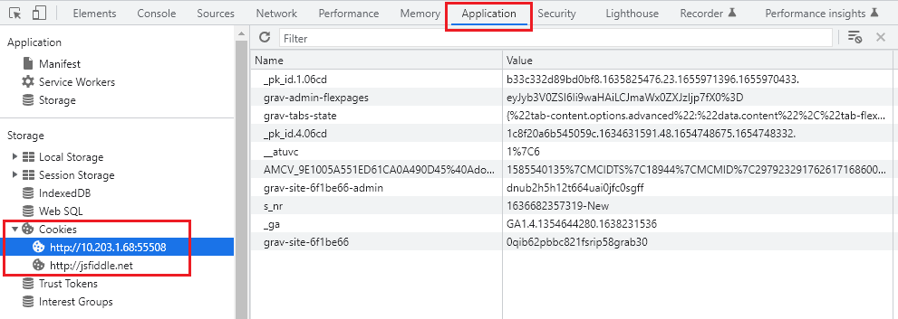

*[page-title]:Cookieについて

参考サイト
: [GoogleChromeのCookieの保存場所確認方法！編集・削除方法など解説！](https://applica.info/chrome-cookie)←デベロッパーツールの項目を参照
: [Cookieとは？仕組みの基本から有効期限や規制について解説](https://jajaaan.co.jp/web-production/basic/cookie/)

## ChromeのCookieの確認方法

デベロッパーツールを開き、Applicationタブの左メニューのCookieをクリックすると、URLとそのサイトで保存されてるCookieのデータが確認できます。




## cookieの使い方

### cookieにデータを書き込む（保存）方法

一般的な書き込みの方法としては【 cookie名 = 値 】という形式で記述していきます。

そして、JavaScriptからブラウザの「cookie」へアクセスするには「document.cookie」を利用することになります。

<p class="tmp"><span>書式1</span>クッキーを保存・参照する</p>
```
	document.cookie
```

<span class="red bold">document.cookieプロパティ</span>は、クッキーを保存・参照します。 クッキーを保存するには、key=value の形式で指定します。

例えば、keyを「name」、value値を「だいち」で書き込む場合、下記のように指定します。
```
document.cookie = 'name=だいち';
```

クッキーの値にはカンマ（,）、セミコロン(;)、ホワイトスペース( )を使用することはできません。 これらが含まれる場合には、<span class="red bold">encodeURIComponent()関数</span>を使用してエンコードする必要があります。  
value値を「だいち　太郎」のようにスペースがある場合、下記のように指定します。

```
document.cookie = 'cookie_name=' + encodeURIComponent('だいち　太郎');
``` 
    
### cookieのデータを取得する方法

「cookie」のデータを取得するために用意された特別なメソッドなどはJavaScriptにありません。  
実は、「cookie」に格納されているデータは単純な文字列（String型）なので、Stringオブジェクトのメソッドを活用することになります。  
主に、文字列を分割できる「split()」メソッドを利用することが多いです。次のサンプル例を見てください！
```
//データを1つずつに分ける
var r = document.cookie.split(';');

r.forEach(function(value) {

		//cookie名と値に分ける
		var content = value.split('=');

		console.log( content[1] );
})
```
 「cookie」に複数のデータが格納されている場合は、「;」で区切られているのでまずは「split(‘;’)」で1つずつに分けて配列化します。  
そして、それぞれのデータをさらに「split(‘=’)」を実行して「cookie名」と「値」に分けます。  
このようにすれば、「cookie」のデータにJavaScriptからアクセスしやすくなるので忘れないようにしておきましょう！


### cookieのデータを削除する方法

「cookie」には有効期限を設定することができます。これにより、期限が過ぎると「cookie」のデータが自動的に削除される仕組みになっているのです。  
JavaScriptには「cookie」を削除するメソッドが無いので、実際にはこの「有効期限」を活用することで意図的に削除することが可能です。  

有効期限は【max-age=秒数】のように、秒数を指定することで設定が可能です。
```
document.cookie = 'name="だいち"; max-age=0';
```
削除する対象として「name=”だいち”」を記述し、そのあとに続けて「max-age=0」と指定することで削除できます。  
「max-age=0」というのは有効期限が「0秒」という意味になるので、即座に削除ができるというわけです


 <div class="exp">
	<p class="tmp"><span>例1</span></p>
	それぞれのボタンを押すことで、cookieにキーと値を格納、取得、削除を行います。
	<a href="sample/index1.html" target="_blank">新規タブ</a>
	<iframe width="100%" height="100" src="sample/index1.html" allowfullscreen="allowfullscreen" allowpaymentrequest frameborder="0"></iframe>
</div>
<script async src="//jsfiddle.net/zw7xmft6/embed/js,html/"></script>


### cookieの設定について

「cookie」のオプション属性を設定する方法について見ていきましょう。  
「有効期限」だけでなく、「有効範囲」や「セキュリティ」などを設定することもできます。


<p class="t-caption">「cookie」のオプション属性</p>

<table>
	<tbody>
		<tr>
			<th>path</th>
			<td>指定したパスがcookieの有効範囲になる</td>
		</tr>
		<tr>
			<th>domain</th>
			<td>指定したドメインがcookieの有効範囲になる</td>
		</tr>
		<tr>
			<th>max-age</th>
			<td>指定した秒数だけ有効期限になる</td>
		</tr>
		<tr>
			<th>expires</th>
			<td>指定した日付までが有効期限になる</td>
		</tr>
		<tr>
			<th>secure</th>
			<td>https通信の時だけcookieが有効になる</td>
		</tr>
	</tbody>
</table>

<p class="bold">cookieの「有効期限」を設定する方法</p>

有効期限を設定するには「max-age」属性を使って次のように記述します。
```
document.cookie = 'name="だいち"; max-age=180';
```
 「max-age=180」と設定すれば、3分後に「name=”太郎”」というcookie情報が削除されることになるわけです。<br>
これは単純で簡単な方法ですが、数週間後とか1ヶ月後などのように日程を指定したい場合もあるでしょう。その場合は「expires」属性を付与することになります。

ただし、日本時間ではなく「GMT（グリニッジ標準時）」形式で指定する必要がある点に注意しましょう。次のサンプル例を見てください！
```
//有効期限の日時を指定する
var count = new Date('2018/3/10 18:00');

//GMTで期限を設定する
document.cookie = 'name=太郎; expires=' + count.toUTCString();
```

 まず最初に、設定したい有効期限の日時をDateオブジェクトで指定します。<br>
そして、GMT形式に変換するために「toUTCString()」メソッドを利用すればOKです！これにより秒数ではなく日程を指定することで有効期限を決めることが出来るわけです。


## cookieの判定処理

「cookie」を扱うようになると、任意のデータがすでに格納されているかどうかを判定したいケースがよくあります。<br>
この場合に、便利なメソッドとしてStringオブジェクトで用意されている「<span class="red bold">indexOf()</span>」メソッドです。<br>
例えば、次のサンプル例を見てください！


<div class="exp">
	<p class="tmp"><span>例</span></p>
</div>
```
document.cookie = 'number=123';
var r = document.cookie.indexOf('number');
console.log(r);
```

<p class="result"><span>結果</span></p>

	０

 この例では、cookieへ「number=123」というデータを格納しています。そのあとに、「indexOf()」を使ってcookie内に「number」という文字列が含まれているかどうかをチェックしているわけです。  
もし、見つからなければ「-1」が返されて、見つかった場合は何文字目に存在しているかを数値で返してくれます。  
この仕組みを利用すれば、条件分岐を簡単に作れます！

<div class="exp">
	<p class="tmp"><span>例</span></p>
</div>
```
document.cookie = 'number=123';

var result = document.cookie.indexOf('name');

if(result !== -1) {
		console.log('存在します');
}
else {
		console.log('存在しません！');
}
```

<p class="result"><span>結果</span></p>
	存在しません！

 この例では、「indexOf()」を使って取得した数値を「IF文」の条件式に当てはめているのが分かりますね。  
このサンプル例では、「name」という文字列がcookieに含まれているかを調べています。実際には含まれていないので、実行結果のようにIF文の「flaseの処理」が実行されているわけです。


## まとめ
+ cookieへ書き込む場合は「document.cookie」を使う
+ cookieを取得するには「split()」メソッドを活用する
+ cookieを削除するには「有効期限」を利用する
+ cookieはオプション属性を設定することができる


