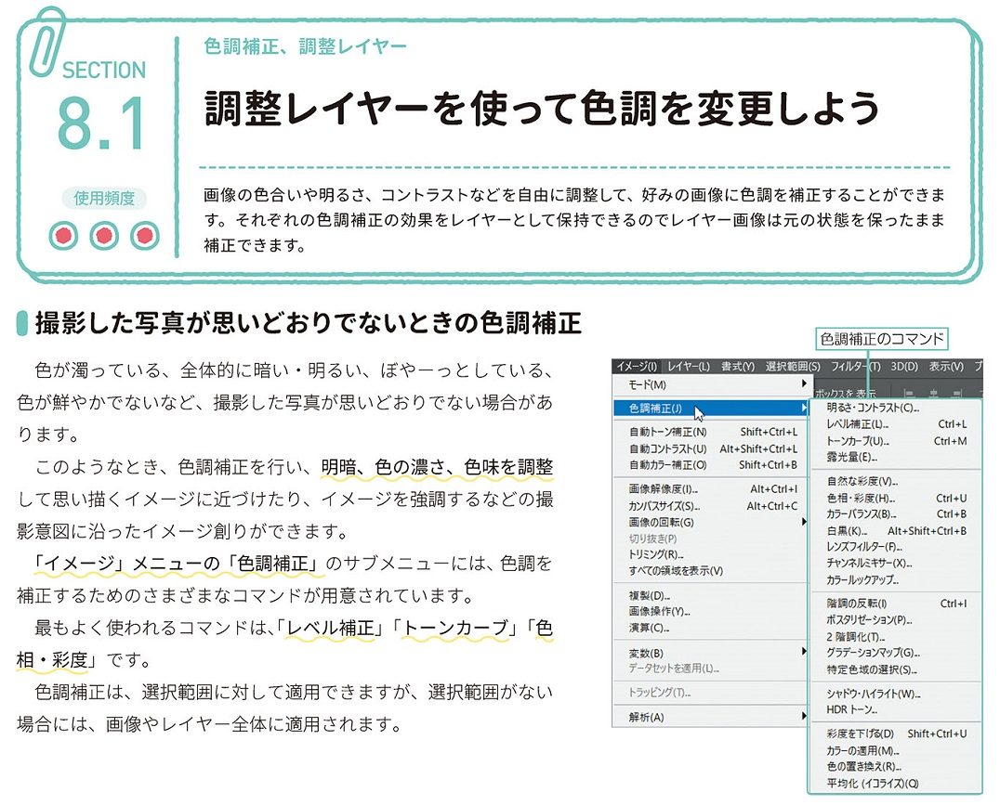
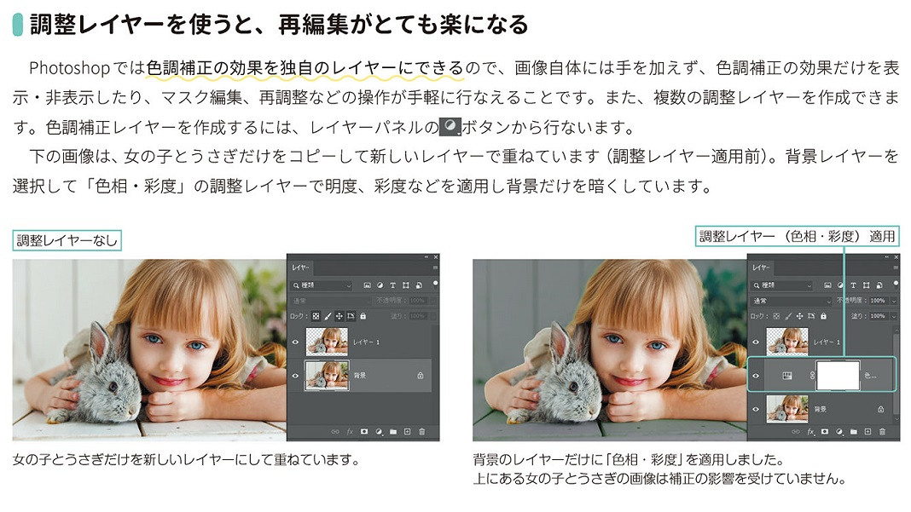
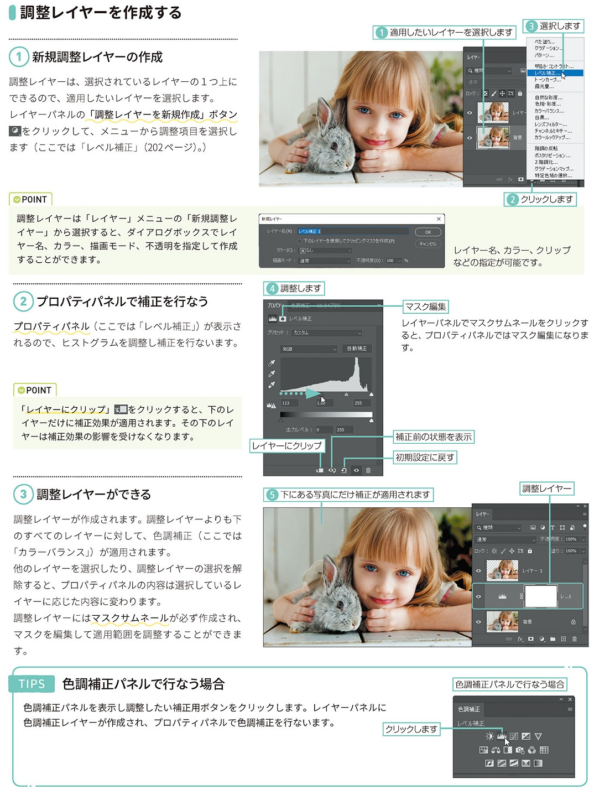
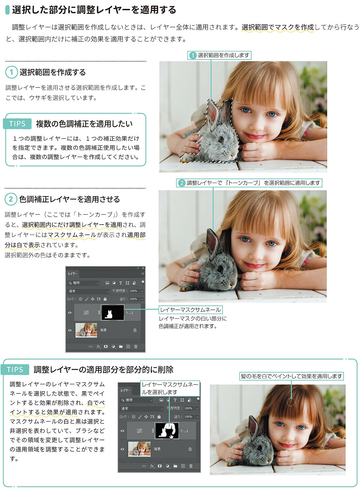
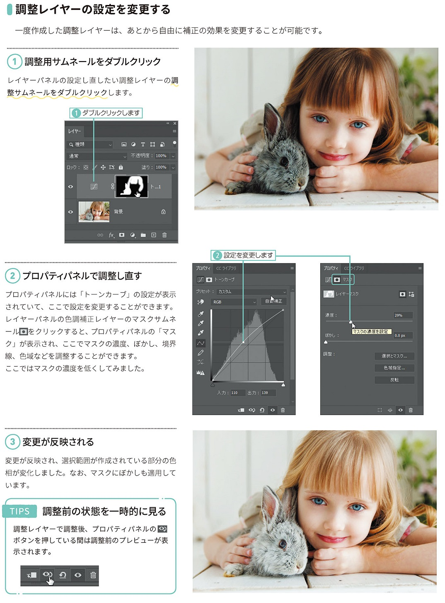

*[page-title]:8-1. 調整レイヤーを使って色調を変更しよう

## 撮影した写真が思いどおりでないときの色調補正 ##{.sr-only}

画像の色合いや明るさ、コントラストなどを自由に調整して、好みの画像に色調を補正することができま す。それぞれの色調補正の効果をレイヤーとして保持できるのでレイヤー画像は元の状態を保ったまま 補正できます。
撮影した写真が思いどおりでないときの色調補正
色が濁っている、全体的に暗い・明るい、ぼやーっとしている、 色が鮮やかでないなど、撮影した写真が思いどおりでない場合があ ります。
このようなとき、色調補正を行い、明暗、色の濃さ、色味を調整 して思い描くイメージに近づけたり、イメージを強調するなどの撮 影意図に沿ったイメージ創りができます。
「イメージ」メニューの「色調補正」のサブメニューには、色調を 補正するためのさまざまなコマンドが用意されています。 最もよく使われるコマンドは、「レベル補正」「トーンカーブ」「色 相・彩度」です。
色調補正は、選択範囲に対して適用できますが、選択範囲がない 場合には、画像やレイヤー全体に適用されます。

{.image}

## 調整レイヤーを使うと、再編集がとても楽になる ##{.sr-only}

Photoshopでは色調補正の効果を独自のレイヤーにできるので、画像自体には手を加えず、色調補正の効果だけを表 示・非表示したり、マスク編集、再調整などの操作が手軽に行なえることです。また、複数の調整レイヤーを作成できま す。色調補正レイヤーを作成するには、レイヤーパネルのボタンから行ないます。
下の画像は、女の子とうさぎだけをコピーして新しいレイヤーで重ねています(調整レイヤー適用前)。背景レイヤーを 選択して「色相・彩度」の調整レイヤーで明度、彩度などを適用し背景だけを暗くしています。

{.image}

## 調整レイヤーを作成する ##{.sr-only}

(1)新規調整レイヤーの作成 調整レイヤーは、選択されているレイヤーの1つ上に できるので、適用したいレイヤーを選択します。 レイヤーパネルの「調整レイヤーを新規作成」ボタン 日をクリックして、メニューから調整項目を選択し ます(ここでは「レベル補正」。)
POINT 
調整レイヤーは「レイヤー」メニューの「新規調整レ イヤー」から選択すると、ダイアログボックスでレイ ヤー名、カラー、描画モード、不透明を指定して作成 することができます。
(2)プロパティパネルで補正を行なう
プロパティパネル(ここでは「レベル補正」)が表示さ れるので、ヒストグラムを調整し補正を行ないます。
POINT 
「レイヤーにクリップ」をクリックすると、下のレ イヤーだけに補正効果が適用されます。その下のレイ ヤーは補正効果の影響を受けなくなります。
(3)調整レイヤーができる
調整レイヤーが作成されます。調整レイヤーよりも下 のすべてのレイヤーに対して、色調補正(ここでは 「カラーバランス」)が適用されます。 他のレイヤーを選択したり、調整レイヤーの選択を解 除すると、プロパティパネルの内容は選択しているレ イヤーに応じた内容に変わります。 調整レイヤーにはマスクサムネールが必ず作成され、 マスクを編集して適用範囲を調整することができます。
TIPS 「色調補正パネルで行なう場合
色調補正パネルを表示し調整したい補正用ボタンをクリックします。レイヤーパネルに 色調補正レイヤーが作成され、プロパティパネルで色調補正を行ないます。

{.image}

## 選択した部分に調整レイヤーを適用する ##{.sr-only}

調整レイヤーは選択範囲を作成しないときは、レイヤー全体に適用されます。選択範囲でマスクを作成してから行なう と、選択範囲内だけに補正の効果を適用することができます。
(1)選択範囲を作成する
調整レイヤーを適用させる選択範囲を作成します。こ こでは、ウサギを選択しています。
TIPS
複数の色調補正を適用したい
1つの調整レイヤーには、1つの補正効果だけ を指定できます。複数の色調補正使用したい場 合は、複数の調整レイヤーを作成してください。
(2)色調補正レイヤーを適用させる
調整レイヤー(ここでは「トーンカーブ」)を作成す ると、選択範囲内にだけ調整レイヤーを適用され、調 整レイヤーにはマスクサムネールが表示され適用部 分は白で表示されています。 選択範囲外の色はそのままです。
TIPS 調整レイヤーの適用部分を部分的に削除
調整レイヤーのレイヤーマスクサム ネールを選択した状態で、黒でペイ ントすると効果が削除され、白でペ イントすると効果が適用されます。 マスクサムネールの白と黒は選択と 非選択を表わしていて、ブラシなど でその領域を変更して調整レイヤー の適用領域を調整することができます。

{.image}

## 調整レイヤーの設定を変更する ##{.sr-only}

一度作成した調整レイヤーは、あとから自由に補正の効果を変更することが可能です。
(1)調整用サムネールをダブルクリック
レイヤーパネルの設定し直したい調整レイヤーの調 整サムネールをダブルクリックします。
(2)プロパティパネルで調整し直す
プロパティパネルには「トーンカーブ」の設定が表示 されていて、ここで設定を変更することができます。 レイヤーパネルの色調補正レイヤーのマスクサムネ ール目をクリックすると、プロパティパネルの「マス ク」が表示され、ここでマスクの濃度、ぼかし、境界 線、色域などを調整することができます。 ここではマスクの濃度を低くしてみました。
(3)変更が反映される
変更が反映され、選択範囲が作成されている部分の色 相が変化しました。なお、マスクにぼかしも適用して います。
TIPS 調整前の状態を一時的に見る
調整レイヤーで調整後、プロパティパネルの ボタンを押している間は調整前のプレビューが表 示されます。

{.image}

