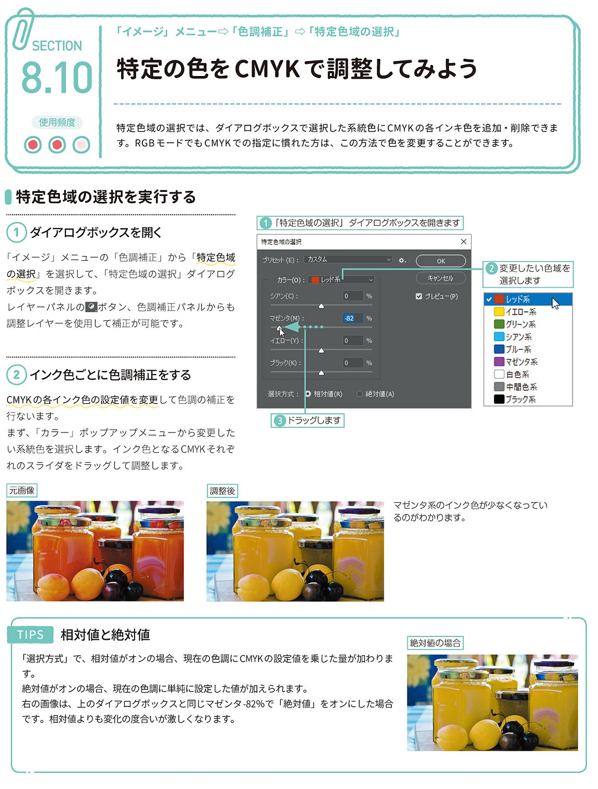

*[page-title]:8-10. 特定の色をCMYKで調整してみよう

## 特定色域の選択を実行する ##{.sr-only}

(1) ダイアログボックスを開く 
「イメージ」メニューの「色調補正」から「特定色域 の選択」を選択して、「特定色域の選択」ダイアログ ボックスを開きます。 レイヤーパネルのボタン、色調補正パネルからも 調整レイヤーを使用して補正が可能です。
(2)インク色ごとに色調補正をする 
CMYKの各インク色の設定値を変更して色調の補正を 行ないます。 まず、「カラー」ポップアップメニューから変更した い系統色を選択します。インク色となるCMYKそれぞ れのスライダをドラッグして調整します。
TIPS 相対値と絶対値
「選択方式」で、相対値がオンの場合、現在の色調にCMYKの設定値を乗じた量が加わりま す。 絶対値がオンの場合、現在の色調に単純に設定した値が加えられます。 右の画像は、上のダイアログボックスと同じマゼンタ -82%で「絶対値」をオンにした場合 です。相対値よりも変化の度合いが激しくなります。

{.image}

