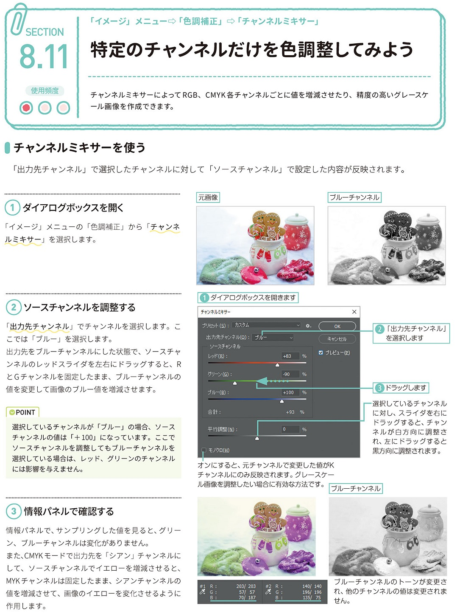

*[page-title]:8-11. 特定のチャンネルだけを色調整してみよう

## チャンネルミキサーを使う ##{.sr-only}

チャンネルミキサーによって RGB、CMYK各チャンネルごとに値を増減させたり、精度の高いグレースケ ール画像を作成できます。
「出力先チャンネル」で選択したチャンネルに対して「ソースチャンネル」で設定した内容が反映されます。
(1)ダイアログボックスを開く 
「イメージ」メニューの「色調補正」から「チャンネ ルミキサー」を選択します。
(2)ソースチャンネルを調整する
「出力先チャンネル」でチャンネルを選択します。こ こでは「ブルー」を選択します。 出力先をブルーチャンネルにした状態で、ソースチャ ンネルのレッドスライダを左右にドラッグすると、R とGチャンネルを固定したまま、ブルーチャンネルの 値を変更して画像のブルー値を増減させます。
POINT 選択しているチャンネルが「ブルー」の場合、ソース チャンネルの値は「+100」になっています。ここで ソースチャンネルを調整してもブルーチャンネルを 選択している場合は、レッド、グリーンのチャンネル には影響を与えません。
(3)情報パネルで確認する 
情報パネルで、サンプリングした値を見ると、グリー ン、ブルーチャンネルは変化がありません。 また、CMYKモードで出力先を「シアン」チャンネルに して、ソースチャンネルでイエローを増減させると、 MYKチャンネルは固定したまま、シアンチャンネルの 値を増減させて、画像のイエローを変化させるように 作用します。

{.image}

