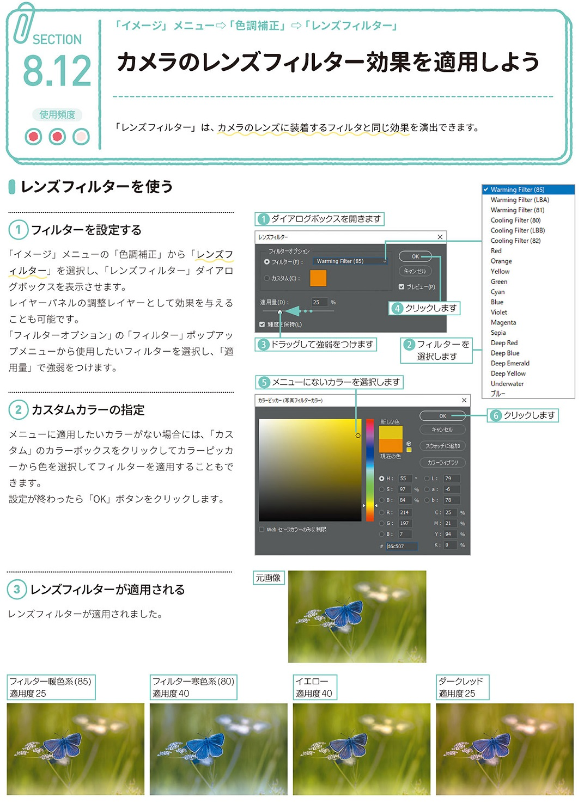

*[page-title]:8-12. カメラのレンズフィルター効果を適用しよう

## レンズフィルターを使う ##{.sr-only}

「レンズフィルター」は、カメラのレンズに装着するフィルタと同じ効果を演出できます。
(1)フィルターを設定する
 「イメージ」メニューの「色調補正」から「レンズフ ィルター」を選択し、「レンズフィルター」ダイアロ グボックスを表示させます。 レイヤーパネルの調整レイヤーとして効果を与える ことも可能です。 「フィルターオプション」の「フィルター」ポップアッ プメニューから使用したいフィルターを選択し、「適用量」で強弱をつけます。
(2)カスタムカラーの指定 
メニューに適用したいカラーがない場合には、「カス タム」のカラーボックスをクリックしてカラーピッカ ーから色を選択してフィルターを適用することもで きます。 設定が終わったら「OK」ボタンをクリックします。
(3)フィルターが適用される
レンズフィルターが適用されました。

{.image}

