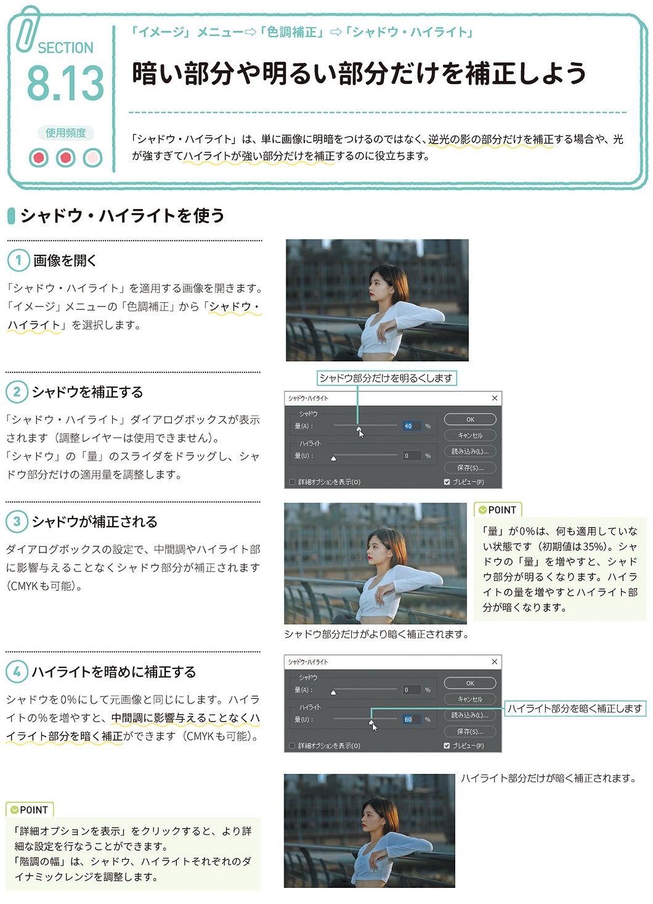

*[page-title]:8-13. 暗い部分や明るい部分だけを補正しよう

## シャドウ・ハイライトを使う ##{.sr-only}

「シャドウ・ハイライト」は、単に画像に明暗をつけるのではなく、逆光の影の部分だけを補正する場合や、光 が強すぎてハイライトが強い部分だけを補正するのに役立ちます。
(1) 画像を開く
「シャドウ・ハイライト」を適用する画像を開きます。 「イメージ」メニューの「色調補正」から「シャドウ・ ハイライト」を選択します。
(2)シャドウを補正する。
「シャドウ・ハイライト」ダイアログボックスが表示 されます(調整レイヤーは使用できません)。 「シャドウ」の「量」のスライダをドラッグし、シャ ドウ部分だけの適用量を調整します。
(3)シャドウが補正される 
ダイアログボックスの設定で、中間調やハイライト部 に影響与えることなくシャドウ部分が補正されます (CMYKも可能)。
POINT 「量」が0%は、何も適用していな い状態です(初期値は35%)。シャ ドウの「量」を増やすと、シャド ウ部分が明るくなります。ハイラ イトの量を増やすとハイライト部 分が暗くなります。
(4)ハイライトを暗めに補正する
シャドウを0%にして元画像と同じにします。ハイラ イトの%を増やすと、中間調に影響与えることなくハ イライト部分を暗く補正ができます(CMYKも可能)。
POINT 「詳細オプションを表示」をクリックすると、より詳 細な設定を行なうことができます。 「階調の幅」は、シャドウ、ハイライトそれぞれのダ イナミックレンジを調整します。

{.image}

