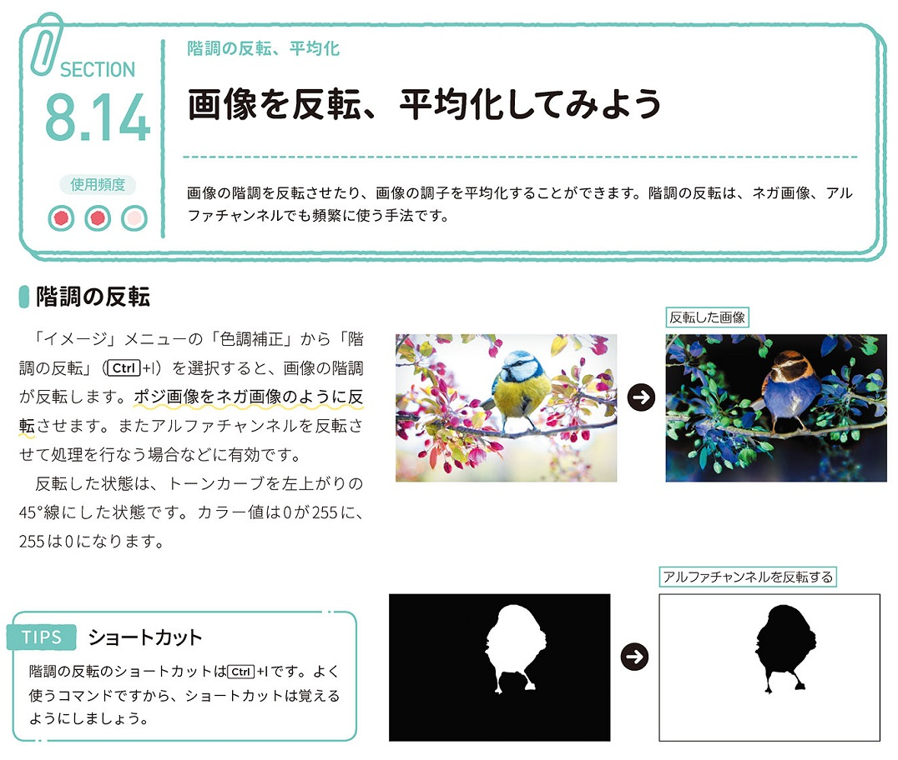
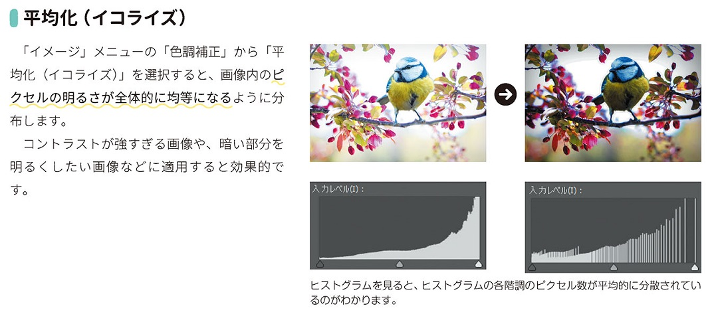

*[page-title]:8-14. 画像を反転、平均化してみよう

## 階調の反転 ##{.sr-only}

画像の階調を反転させたり、画像の調子を平均化することができます。階調の反転は、ネガ画像、アル ファチャンネルでも頻繁に使う手法です。
「イメージ」メニューの「色調補正」から「階 調の反転」 [Ctrl+1)を選択すると、画像の階調 が反転します。ポジ画像をネガ画像のように反 転させます。またアルファチャンネルを反転さ せて処理を行なう場合などに有効です。
反転した状態は、トーンカーブを左上がりの 45°線にした状態です。カラー値は0が255に、 255は0になります。
TIPS
ショートカット
階調の反転のショートカットは「Ctrl]+Iです。よく 使うコマンドですから、ショートカットは覚える ようにしましょう。

{.image}

## 平均化(イコライズ) ##{.sr-only}

「イメージ」メニューの「色調補正」から「平 均化(イコライズ)」を選択すると、画像内のピ クセルの明るさが全体的に均等になるように分 布します。
コントラストが強すぎる画像や、暗い部分を 明るくしたい画像などに適用すると効果的で
す。

{.image}

