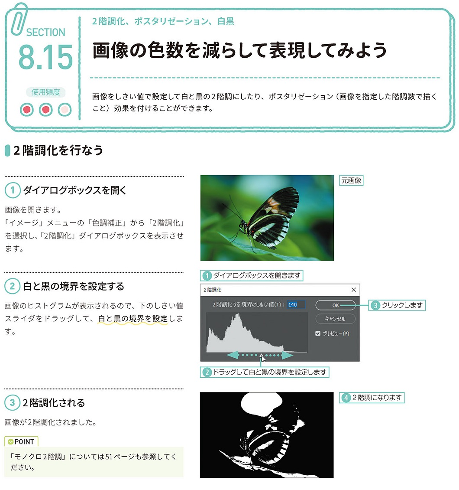
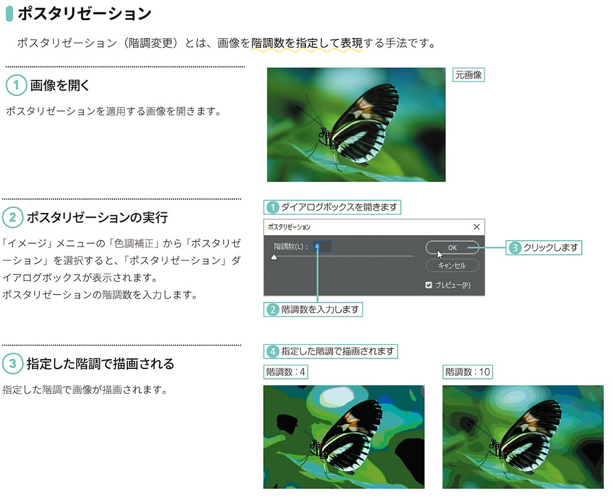
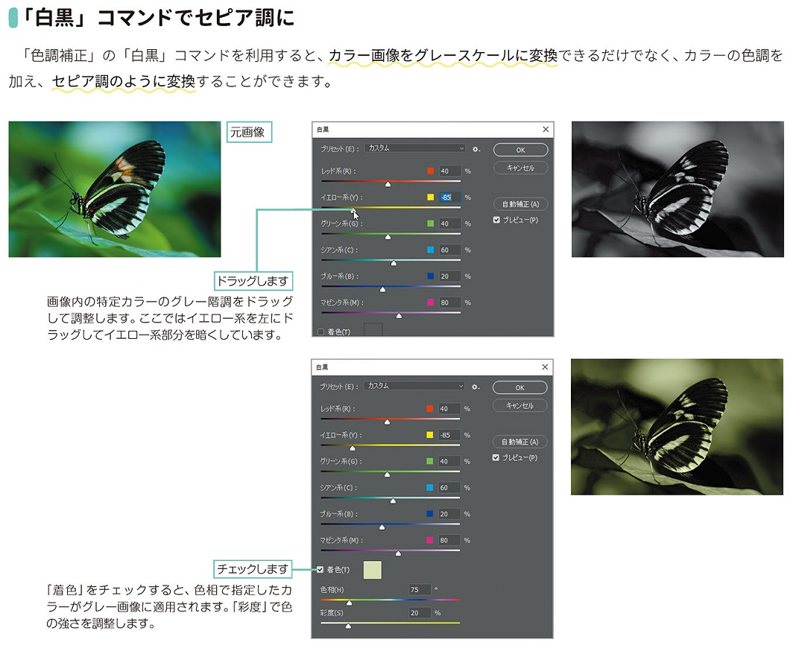

*[page-title]:8-15. 画像の色数を減らして表現してみよう

## 2階調化を行なう ##{.sr-only}

画像をしきい値で設定して白と黒の2階調にしたり、ポスタリゼーション (画像を指定した階調数で描く 10001 こと)効果を付けることができます。
2階調化を行なう
(1) ダイアログボックスを開く
画像を開きます。 「イメージ」メニューの「色調補正」から「2階調化」 を選択し、「2階調化」ダイアログボックスを表示させ ます。
(2)白と黒の境界を設定する 
画像のヒストグラムが表示されるので、下のしきい値 スライダをドラッグして、白と黒の境界を設定します。
(3)2階調化される
画像が2階調化されました。
POINT 「モノクロ2階調」については51 ページも参照してく ださい。

{.image}

## ポスタリゼーション ##{.sr-only}

ポスタリゼーション(階調変更)とは、画像を階調数を指定して表現する手法です。
(1)画像を開く
ポスタリゼーションを適用する画像を開きます。
(2)ポスタリゼーションの実行 
「イメージ」メニューの「色調補正」から「ポスタリゼ ーション」を選択すると、「ポスタリゼーション」ダ イアログボックスが表示されます。 ポスタリゼーションの階調数を入力します。
(3)指定した階調で描画される
指定した階調で画像が描画されます。

{.image}

## 「白黒」コマンドでセピア調に ##{.sr-only}

「色調補正」の「白黒」コマンドを利用すると、カラー画像をグレースケールに変換できるだけでなく、カラーの色調を 加え、セピア調のように変換することができます。

{.image}

