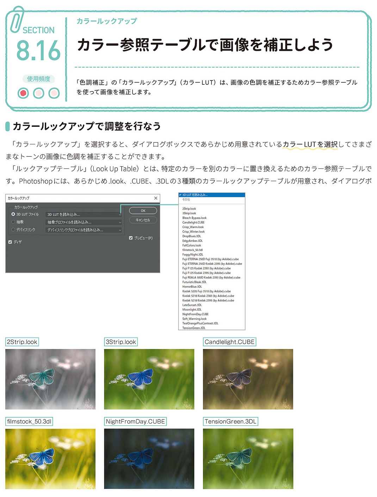

*[page-title]:8-16. カラー参照テーブルで画像を補正しよう

## カラールックアップで調整を行なう ##{.sr-only}

「色調補正」の「カラールックアップ」(カラーLUT)は、画像の色調を補正するためカラー参照テーブル を使って画像を補正します。
「カラールックアップ」を選択すると、ダイアログボックスであらかじめ用意されているカラーLUTを選択してさまざ まなトーンの画像に色調を補正することができます。
「ルックアップテーブル」(Look Up Table)とは、特定のカラーを別のカラーに置き換えるためのカラー参照テーブルで す。Photoshopには、あらかじめ.look、.CUBE.3DLの3種類のカラールックアップテーブルが用意され、ダイアログボ

{.image}

