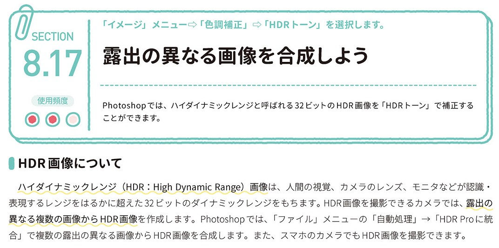
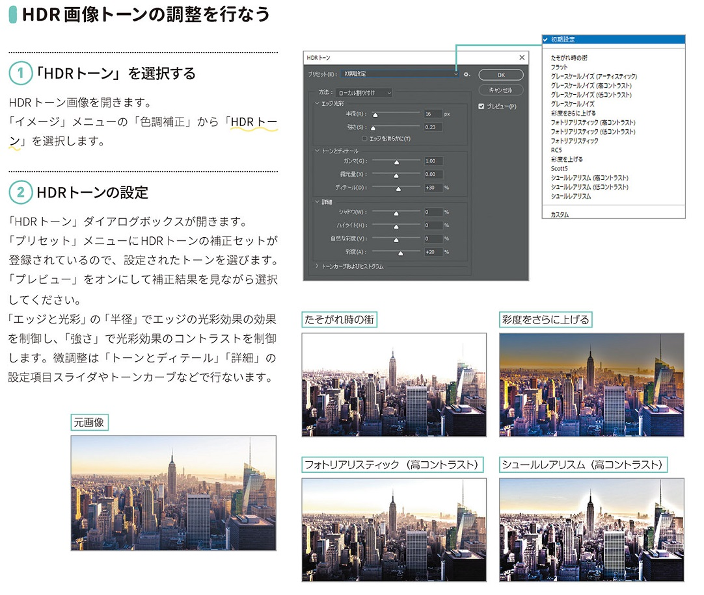

*[page-title]:8-17. 露出の異なる画像を合成しよう

## HDR画像について ##{.sr-only}

Photoshopでは、ハイダイナミックレンジと呼ばれる32ビットのHDR画像を「HDRトーン」で補正する ことができます。
ハイダイナミックレンジ(HDR: High Dynamic Range)画像は、人間の視覚、カメラのレンズ、モニタなどが認識・ 表現するレンジをはるかに超えた32 ビットのダイナミックレンジをもちます。HDR画像を撮影できるカメラでは、露出の 異なる複数の画像から HDR画像を作成します。Photoshopでは、「ファイル」メニューの「自動処理」→「HDR Proに統 合」で複数の露出の異なる画像からHDR画像を合成します。また、スマホのカメラでもHDR画像を撮影できます。

{.image}

## HDR画像トーンの調整を行なう ##{.sr-only}

(1)「HDRトーン」を選択する
HDRトーン画像を開きます。 「イメージ」メニューの「色調補正」から「HDR トー ン」を選択します。
「HDRトーン」ダイアログボックスが開きます。 「プリセット」メニューにHDRトーンの補正セットが 登録されているので、設定されたトーンを選びます。 「プレビュー」をオンにして補正結果を見ながら選択 してください。 「エッジと光彩」の「半径」でエッジの光彩効果の効果 を制御し、「強さ」で光彩効果のコントラストを制御 します。微調整は「トーンとディテール」「詳細」の 設定項目スライダやトーンカーブなどで行ないます。

{.image}

