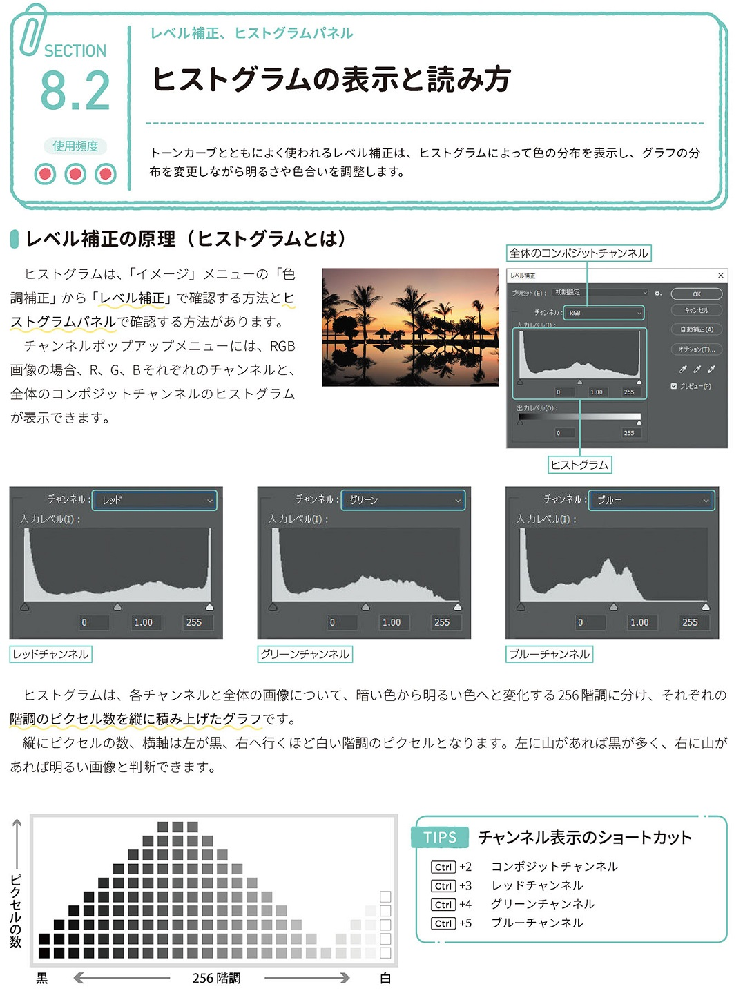
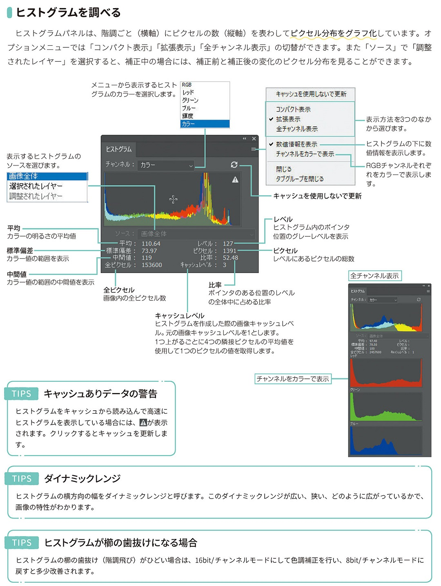

*[page-title]:8-2. ヒストグラムの表示と読み方

## レベル補正の原理 (ヒストグラムとは) ##{.sr-only}

トーンカーブとともによく使われるレベル補正は、ヒストグラムによって色の分布を表示し、グラフの分 布を変更しながら明るさや色合いを調整します。
ヒストグラムは、「イメージ」メニューの「色 調補正」から「レベル補正」で確認する方法とヒ ストグラムパネルで確認する方法があります。 - チャンネルポップアップメニューには、RGB 画像の場合、R、G、Bそれぞれのチャンネルと、 全体のコンポジットチャンネルのヒストグラム が表示できます。
ヒストグラムは、各チャンネルと全体の画像について、暗い色から明るい色へと変化する256階調に分け、それぞれの 階調のピクセル数を縦に積み上げたグラフです。
縦にピクセルの数、横軸は左が黒、右へ行くほど白い階調のピクセルとなります。左に山があれば黒が多く、右に山が あれば明るい画像と判断できます。

{.image}

## ヒストグラムを調べる ##{.sr-only}

ヒストグラムパネルは、階調ごと(横軸)にピクセルの数(縦軸)を表わしてピクセル分布をグラフ化しています。オ プションメニューでは「コンパクト表示」「拡張表示」「全チャンネル表示」の切替ができます。また「ソース」で「調整 されたレイヤー」を選択すると、補正中の場合には、補正前と補正後の変化のピクセル分布を見ることができます。
TIPS キャッシュありデータの警告
ヒストグラムをキャッシュから読み込んで高速に ヒストグラムを表示している場合には、Aが表示 されます。クリックするとキャッシュを更新しま
す。
TIPS ダイナミックレンジ
ヒストグラムの横方向の幅をダイナミックレンジと呼びます。このダイナミックレンジが広い、狭い、どのように広がっているかで、 画像の特性がわかります。
TIPS ヒストグラムが櫛の歯抜けになる場合
ヒストグラムの櫛の歯抜け(階調飛び)がひどい場合は、16bit/チャンネルモードにして色調補正を行い、8bit/チャンネルモードに 戻すと多少改善されます。

{.image}

