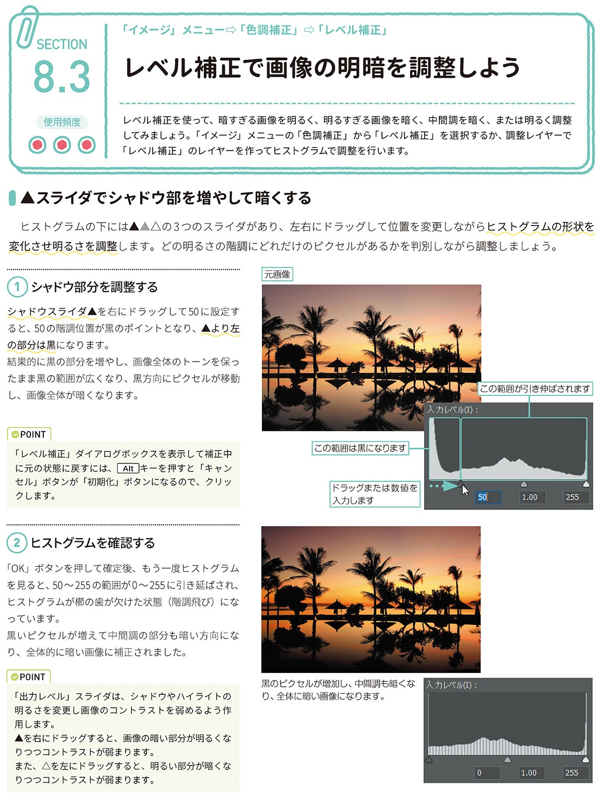
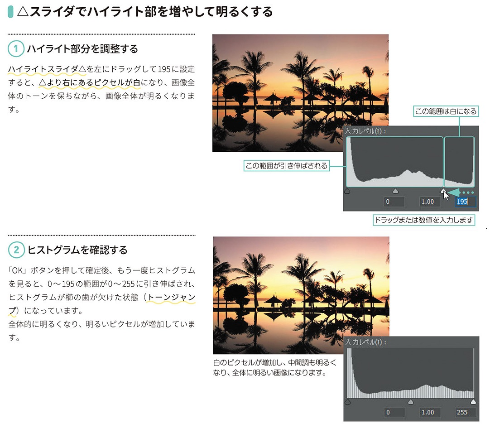
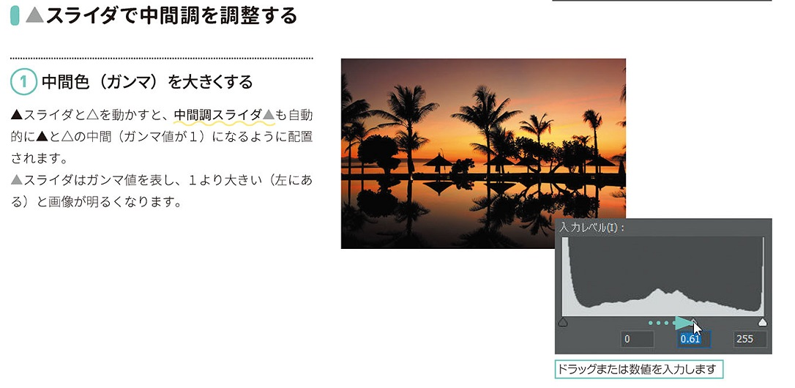
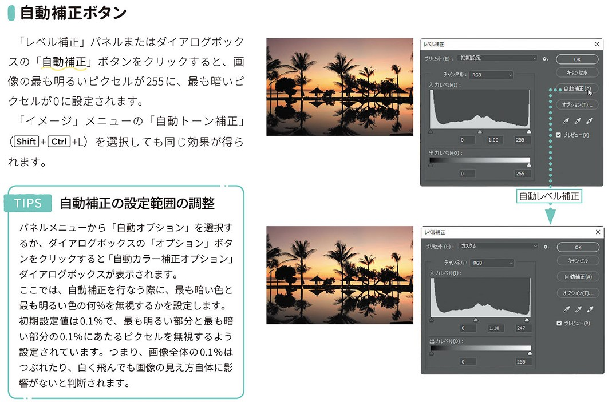
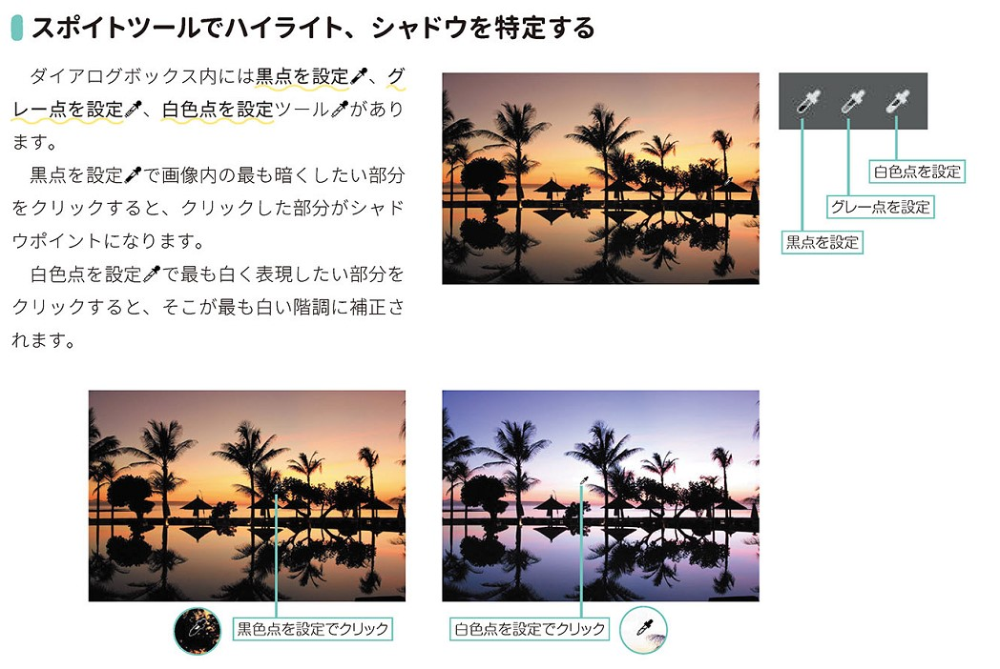

*[page-title]:8-3. レベル補正で画像の明暗を調整しよう

## ▲スライダでシャドウ部を増やして暗くする ##{.sr-only}

レベル補正を使って、暗すぎる画像を明るく、明るすぎる画像を暗く、中間調を暗く、または明るく調整 してみましょう。「イメージ」メニューの「色調補正」から「レベル補正」を選択するか、調整レイヤーで 「レベル補正」のレイヤーを作ってヒストグラムで調整を行います。
ヒストグラムの下には△▲△の3つのスライダがあり、左右にドラッグして位置を変更しながらヒストグラムの形状を 変化させ明るさを調整します。どの明るさの階調にどれだけのピクセルがあるかを判別しながら調整しましょう。
(1) シャドウ部分を調整する
シャドウスライダムを右にドラッグして50に設定す ると、50の階調位置が黒のポイントとなり、より左 の部分は黒になります。 結果的に黒の部分を増やし、画像全体のトーンを保っ たまま黒の範囲が広くなり、黒方向にピクセルが移動 し、画像全体が暗くなります。
POINT 
「レベル補正」ダイアログボックスを表示して補正中 に元の状態に戻すには、[Alt]キーを押すと「キャン セル」ボタンが「初期化」ボタンになるので、クリッ クします。
(2)ヒストグラムを確認する
「OK」ボタンを押して確定後、もう一度ヒストグラム を見ると、50~255 の範囲が0~255に引き延ばされ、 ヒストグラムが櫛の歯が欠けた状態(階調飛び)にな っています。 黒いピクセルが増えて中間調の部分も暗い方向にな り、全体的に暗い画像に補正されました。
POINT
黒のピクセルが増加し、中間調も暗くな入力レベル(I):り、全体に暗い画像になります。
「出力レベル」スライダは、シャドウやハイライトの 明るさを変更し画像のコントラストを弱めるよう作 用します。 ▲を右にドラッグすると、画像の暗い部分が明るくな りつつコントラストが弱まります。 また、△を左にドラッグすると、明るい部分が暗くな りつつコントラストが弱まります。

{.image}

## △スライダでハイライト部を増やして明るくする ##{.sr-only}

(1)ハイライト部分を調整する
ハイライトスライダ△を左にドラッグして195に設定 すると、△より右にあるピクセルが白になり、画像全 体のトーンを保ちながら、画像全体が明るくなります。
(2) ヒストグラムを確認する
「OK」ボタンを押して確定後、もう一度ヒストグラム を見ると、0~195の範囲が0~255に引き伸ばされ、 ヒストグラムが櫛の歯が欠けた状態(トーンジャン プ)になっています。 全体的に明るくなり、明るいピクセルが増加しています。

{.image}

## ▲スライダで中間調を調整する ##{.sr-only}

(1)中間色(ガンマ)を大きくする
▲スライダと△を動かすと、中間調スライダムも自動 的にへとへの中間(ガンマ値が1)になるように配置 されます。 ▲スライダはガンマ値を表し、1より大きい(左にあ る)と画像が明るくなります。

{.image}

## 自動補正ボタン ##{.sr-only}

「レベル補正」パネルまたはダイアログボック スの「自動補正」ボタンをクリックすると、画 像の最も明るいピクセルが255に、最も暗いピ クセルが0に設定されます。
「イメージ」メニューの「自動トーン補正」 (Shift]+[Ctrl+L)を選択しても同じ効果が得られます。
TIPS 自動補正の設定範囲の調整
パネルメニューから「自動オプション」を選択す るか、ダイアログボックスの「オプション」ボタ ンをクリックすると「自動カラー補正オプション」 ダイアログボックスが表示されます。 ここでは、自動補正を行なう際に、最も暗い色と 最も明るい色の何%を無視するかを設定します。 初期設定値は 0.1%で、最も明るい部分と最も暗 い部分の0.1%にあたるピクセルを無視するよう 設定されています。つまり、画像全体の0.1%は つぶれたり、白く飛んでも画像の見え方自体に影 響がないと判断されます。

{.image}

## スポイトツールでハイライト、シャドウを特定する ##{.sr-only}

ダイアログボックス内には黒点を設定が、グ レー点を設定で、白色点を設定ツールがあり ます。
黒点を設定がで画像内の最も暗くしたい部分 をクリックすると、クリックした部分がシャド ウポイントになります。
白色点を設定かで最も白く表現したい部分を クリックすると、そこが最も白い階調に補正さ れます。

{.image}

