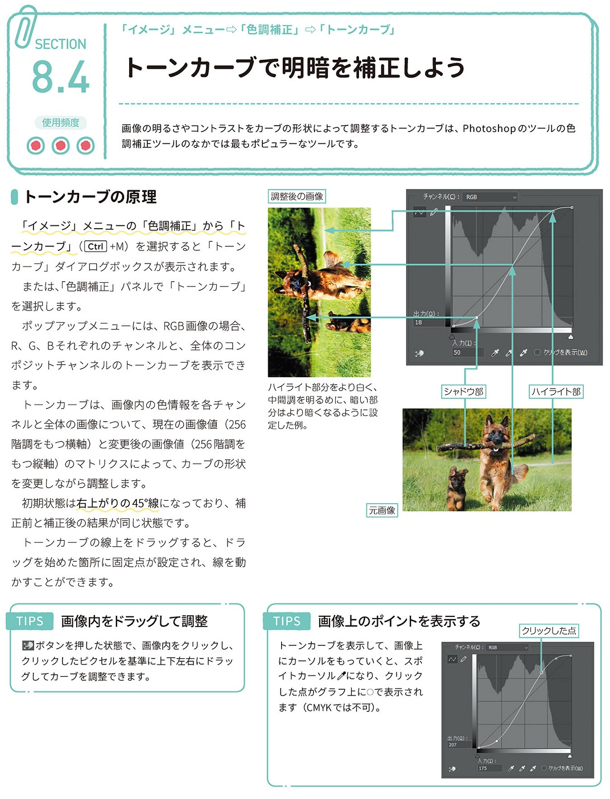
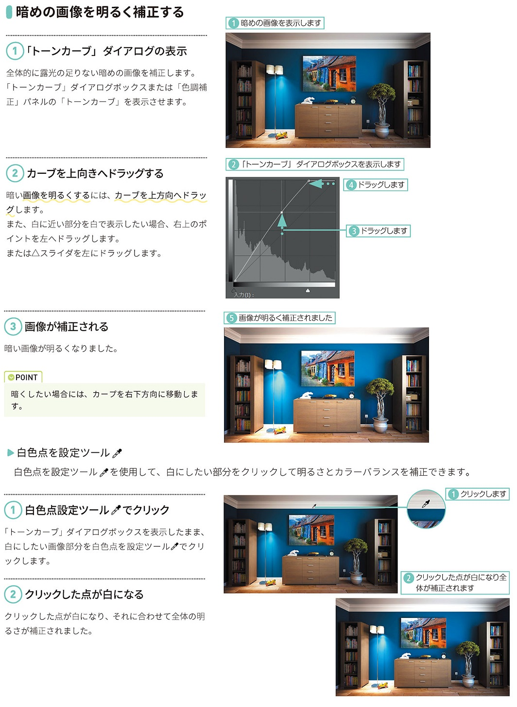

*[page-title]:8-4. トーンカーブで明暗を補正しよう

## トーンカーブの原理  ##{.image}

画像の明るさやコントラストをカーブの形状によって調整するトーンカーブは、Photoshopのツールの色 調補正ツールのなかでは最もポピュラーなツールです。
トーンカーブの原理 
「イメージ」メニューの「色調補正」から「ト ーンカーブ」(Ctrl+M)を選択すると「トーン カーブ」ダイアログボックスが表示されます。
または、「色調補正」パネルで「トーンカーブ」 を選択します。 ・ ポップアップメニューには、RGB画像の場合、 R、G、Bそれぞれのチャンネルと、全体のコン ポジットチャンネルのトーンカーブを表示でき ます。
トーンカーブは、画像内の色情報を各チャン ネルと全体の画像について、現在の画像値(256 階調をもつ横軸)と変更後の画像値(256階調を もつ縦軸)のマトリクスによって、カーブの形状 を変更しながら調整します。
初期状態は右上がりの45°線になっており、補 正前と補正後の結果が同じ状態です。
トーンカーブの線上をドラッグすると、ドラ ッグを始めた箇所に固定点が設定され、線を動 かすことができます。
TIPS 画像内をドラッグして調整
ボタンを押した状態で、画像内をクリックし、 クリックしたピクセルを基準に上下左右にドラッ グしてカーブを調整できます。
TIPS 画像上のポイントを表示する
トーンカーブを表示して、画像上 にカーソルをもっていくと、スポ イトカーソルグになり、クリック した点がグラフ上に○で表示され ます(CMYKでは不可)。

{.image}

## 暗めの画像を明るく補正する ##{.sr-only}

(1)「トーンカーブ」ダイアログの表示
全体的に露光の足りない暗めの画像を補正します。 「トーンカーブ」ダイアログボックスまたは「色調補 「正」パネルの「トーンカーブ」を表示させます。
(2)カーブを上向きヘドラッグする
 暗い画像を明るくするには、カーブを上方向へドラッ グします。 また、白に近い部分を白で表示したい場合、右上のポ イントを左へドラッグします。 または▲スライダを左にドラッグします。
(3)画像が補正される
暗い画像が明るくなりました。
POINT
暗くしたい場合には、カープを右下方向に移動します。
白色点を設定ツール
白色点を設定ツールを使用して、白にしたい部分をクリックして明るさとカラーバランスを補正できます。
(1)白色点設定ツールでクリック
「トーンカーブ」ダイアログボックスを表示したまま、 白にしたい画像部分を白色点を設定ツールがでクリ ックます。
(2)クリックした点が白になる
クリックした点が白になり、それに合わせて全体の明 るさが補正されました。

{.image}

## コントラストをつける ##{.image}

全体的にぼやっとしたねむい画像は、ピクトグラムの山が中央に偏っています。明るい部分と暗い部分の強弱をつけ、 逆にコントラストが強い画像は、コントラストを弱くするようにトーンカーブの調整を行なってみましょう。
(1) 画像を開く
全体的にコントラストが少ない画像を開きます。
(2)ポイントとカーブを調整する
「トーンカーブ」ダイアログボックスまたはパネルで、 シャドウ部を右に、ハイライト部を左に位置させ、中 間調は若干カーブさせます。
TIPS カーブを初期状態に戻す | Alt]キーを押すと、「キャンセル」ボタンが「初 期化」ボタンに変わるので、クリックすると、初 期設定の45°線状態になります。
(3)画像が補正される
画像が補正され、明るい部分がより白に近くなり、暗 い部分がより暗くなり、コントラストが強まりまし た。
TIPS トーンカーブオプション
「トーンカーブ」ダイアログボックスでは、右側にオプションの設定項目があります。「グラフ軸の単位」 では「光量」(RGB 画像で0~255の照度値)と「色材量」(CMYK画像で0~100%が表示)を選択して 調整することができます。 顔料の量を表示する減色法による「色材量」によるトーンカーブが使えます。RGB画像の初期設定は「光 量」、CMYK画像の初期設定は「色材量」で表示されます。「色材量」 は左下隅が白で0-100%で表されます。
また、表示オプションで表示できる基準線、交差線、ヒストグラムな どの項目を選択できます。

{.image}

