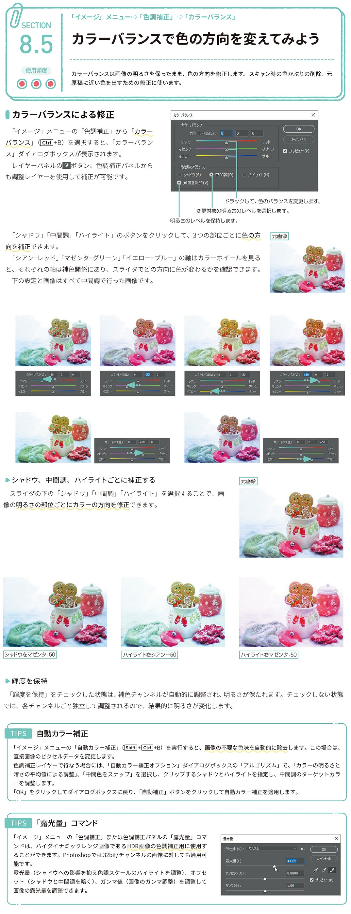

*[page-title]:8-5. カラーバランスで色の方向を変えてみよう

## カラーバランスによる修正 ##{.sr-only}

カラーバランスは画像の明るさを保ったまま、色の方向を修正します。スキャン時の色かぶりの削除、元 原稿に近い色を出すための修正に使います。
「イメージ」メニューの「色調補正」から「カラー バランス」 [Ctrl]+B) を選択すると、「カラーバラン ス」ダイアログボックスが表示されます。
レイヤーパネルのロボタン、色調補正パネルから も調整レイヤーを使用して補正が可能です。
「シャドウ」「中間調」「ハイライト」のボタンをクリックして、3つの部位ごとに色の方元画像 向を補正できます。
「シアン-レッド」「マゼンターグリーン」「イエロー-ブルー」の軸はカラーホイールを見る と、それぞれの軸は補色関係にあり、スライダでどの方向に色が変わるかを確認できます。 下の設定と画像はすべて中間調で行った画像です。
シャドウ、中間調、ハイライトごとに補正する
スライダの下の「シャドウ」「中間調」「ハイライト」を選択することで、画 像の明るさの部位ごとにカラーの方向を修正できます。
輝度を保持
「輝度を保持」をチェックした状態は、補色チャンネルが自動的に調整され、明るさが保たれます。チェックしない状態 では、各チャンネルごと独立して調整されるので、結果的に明るさが変化します。
TIPS 自動カラー補正
「イメージ」メニューの「自動カラー補正」([Shift]+[Ctrl+B) を実行すると、画像の不要な色味を自動的に除去します。この場合は、 直接画像のピクセルデータを変更します。 色調補正レイヤーで行なう場合には、「自動カラー補正オプション」ダイアログボックスの「アルゴリズム」で、「カラーの明るさと 暗さの平均値による調整」、「中間色をスナップ」を選択し、クリップするシャドウとハイライトを指定し、中間調のターゲットカラ ーを調整します。 「OK」をクリックしてダイアログボックスに戻り、「自動補正」ボタンをクリックして自動カラー補正を適用します。
TIPS 「露光量」コマンド
「イメージ」メニューの「色調補正」または色調補正パネルの「露光量」コマ ンドは、ハイダイナミックレンジ画像であるHDR画像の色調補正用に使用す ることができます。Photoshopでは32bit/チャンネルの画像に対しても適用可 能です。 露光量(シャドウへの影響を抑え色調スケールのハイライトを調整)、オフセ ット(シャドウと中間調を暗く)、ガンマ値(画像のガンマ調整)を調整して 画像の露光量を調整できます。

{.image}

