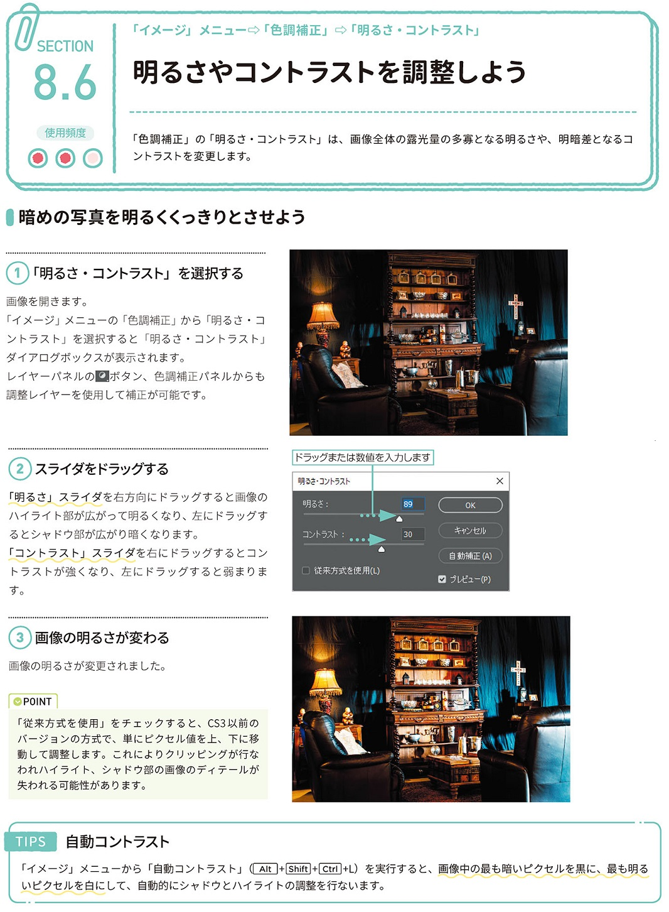

*[page-title]:8-6. 明るさやコントラストを調整しよう

## 暗めの写真を明るくくっきりとさせよう ##{.sr-only}

「色調補正」の「明るさ・コントラスト」は、画像全体の露光量の多寡となる明るさや、明暗差となるコ ントラストを変更します。
(1)「明るさ・コントラスト」を選択する 
画像を開きます。 「イメージ」メニューの「色調補正」から「明るさ・コ ントラスト」を選択すると「明るさ・コントラスト」 ダイアログボックスが表示されます。 レイヤーパネルのロボタン、色調補正パネルからも 調整レイヤーを使用して補正が可能です。
(2)スライダをドラッグする
「明るさ」スライダを右方向にドラッグすると画像の ハイライト部が広がって明るくなり、左にドラッグす るとシャドウ部が広がり暗くなります。 「コントラスト」スライダを右にドラッグするとコン トラストが強くなり、左にドラッグすると弱まりま す。
(3) 画像の明るさが変わる
画像の明るさが変更されました。
POINT 「従来方式を使用」をチェックすると、CS3以前の バージョンの方式で、単にピクセル値を上、下に移 動して調整します。これによりクリッピングが行な われハイライト、シャドウ部の画像のディテールが 失われる可能性があります。
TIPS
自動コントラスト
「イメージ、メニューから「自動コントラスト」(Alt]+[Shift+Ctrl+L) を実行すると、画像中の最も暗いピクセルを黒に、最も明る いピクセルを白にして、自動的にシャドウとハイライトの調整を行ないます。

{.image}

