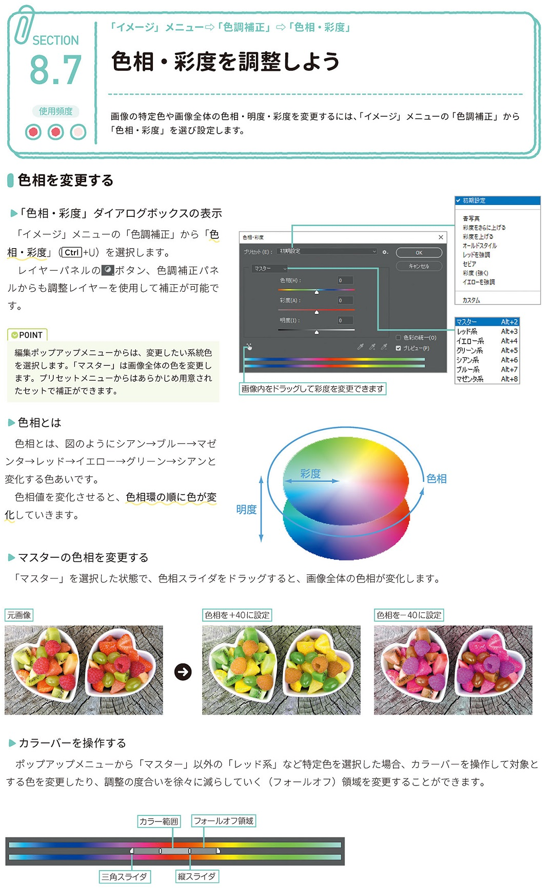
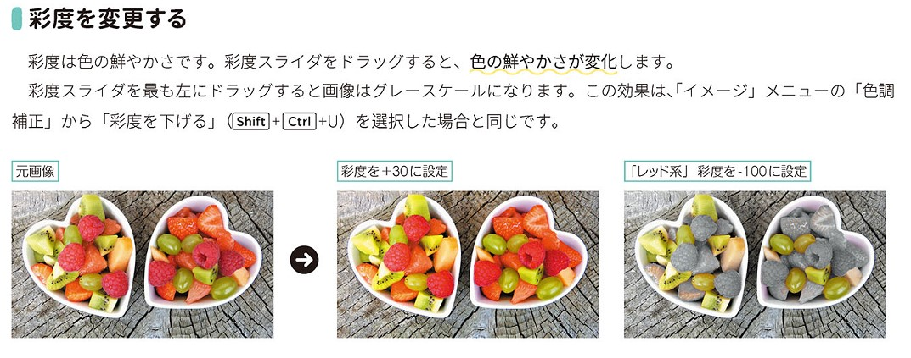
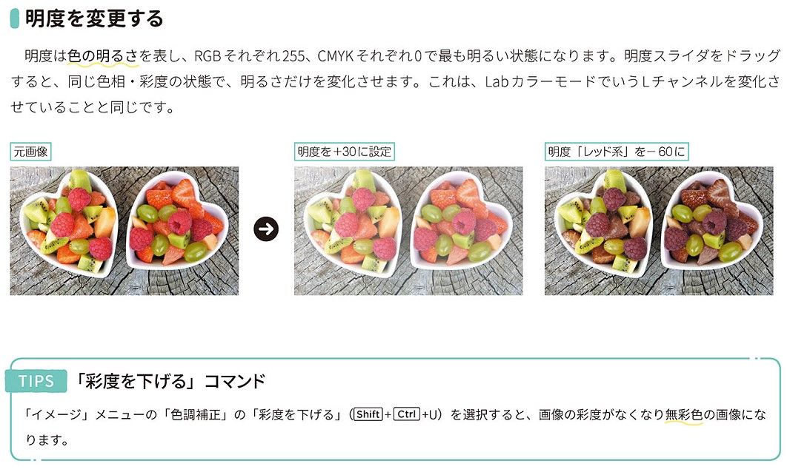
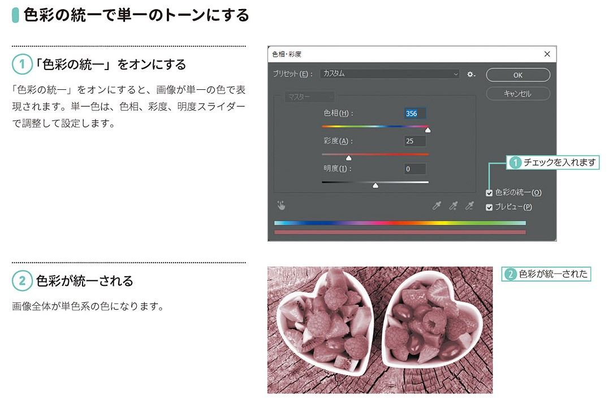
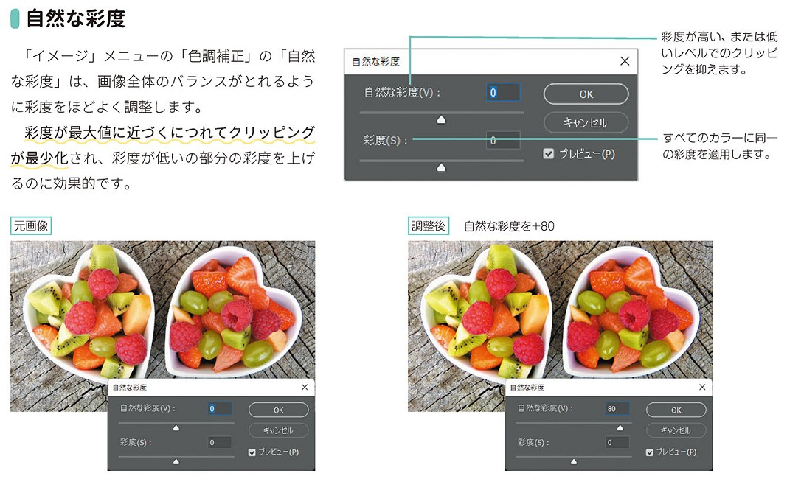

*[page-title]:8-7. 色相・彩度を調整しよう

## 色相を変更する ##{.sr-only}

画像の特定色や画像全体の色相・明度・彩度を変更するには、「イメージ」メニューの「色調補正」から 「色相・彩度」を選び設定します。
「色相・彩度」ダイアログボックスの表示 「イメージ」メニューの「色調補正」から「色 相・彩度」(Ctrl+U)を選択します。
レイヤーパネルのロボタン、色調補正パネ ルからも調整レイヤーを使用して補正が可能です。
POINT 編集ポップアップメニューからは、変更したい系統色 を選択します。「マスター」は画像全体の色を変更し ます。プリセットメニューからはあらかじめ用意され たセットで補正ができます。
色相とは
色相とは、図のようにシアン→ブルー→マゼ ンタ→レッド→イエロー→グリーン→シアンと 変化する色あいです。 - 色相値を変化させると、色相環の順に色が変化していきます。
マスターの色相を変更する
「マスター」を選択した状態で、色相スライダをドラッグすると、画像全体の色相が変化します。
カラーバーを操作する
ポップアップメニューから「マスター」以外の「レッド系」など特定色を選択した場合、カラーバーを操作して対象と する色を変更したり、調整の度合いを徐々に減らしていく(フォールオフ)領域を変更することができます。

{.image}

## 彩度を変更する ##{.sr-only}

彩度は色の鮮やかさです。彩度スライダをドラッグすると、色の鮮やかさが変化します。 彩度スライダを最も左にドラッグすると画像はグレースケールになります。この効果は、「イメージ」メニューの「色調 補正」から「彩度を下げる」(Shift]+[Ctrl+U)を選択した場合と同じです。

{.image}

## 明度を変更する ##{.sr-only}

明度は色の明るさを表し、RGBそれぞれ255、CMYKそれぞれ0で最も明るい状態になります。明度スライダをドラッグ すると、同じ色相・彩度の状態で、明るさだけを変化させます。これは、LabカラーモードでいうLチャンネルを変化さ せていることと同じです。

{.image}

## 色彩の統一で単一のトーンにする ##{.sr-only}

(1)「色彩の統一」をオンにする
「色彩の統一」をオンにすると、画像が単一の色で表 現されます。単一色は、色相、彩度、明度スライダー で調整して設定します。
(2)色彩が統一される。
画像全体が単色系の色になります。

{.image}

## 自然な彩度 ##{.sr-only}

「イメージ」メニューの「色調補正」の「自然 な彩度」は、画像全体のバランスがとれるよう に彩度をほどよく調整します。
彩度が最大値に近づくにつれてクリッピング が最少化され、彩度が低いの部分の彩度を上げ るのに効果的です。

{.image}

