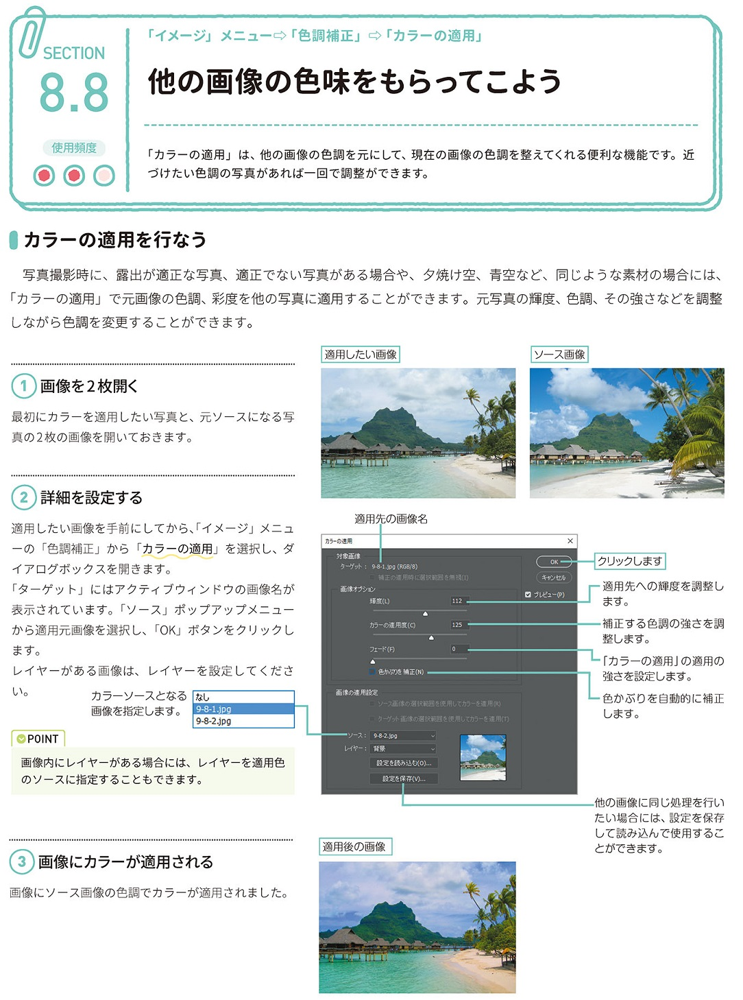

*[page-title]:8-8. 他の画像の色味をもらってこよう

## カラーの適用を行なう ##{.sr-only}

「カラーの適用」は、他の画像の色調を元にして、現在の画像の色調を整えてくれる便利な機能です。近 づけたい色調の写真があれば一回で調整ができます。
写真撮影時に、露出が適正な写真、適正でない写真がある場合や、夕焼け空、青空など、同じような素材の場合には、 「カラーの適用」で元画像の色調、彩度を他の写真に適用することができます。元写真の輝度、色調、その強さなどを調整 しながら色調を変更することができます。
(1) 画像を2枚開く
最初にカラーを適用したい写真と、元ソースになる写 真の2枚の画像を開いておきます。
(2)詳細を設定する
適用したい画像を手前にしてから、「イメージ」メニュ ーの「色調補正」から「カラーの適用」を選択し、ダ イアログボックスを開きます。 「ターゲット」にはアクティブウィンドウの画像名が 表示されています。「ソース」ポップアップメニュー から適用元画像を選択し、「OK」ボタンをクリックし ます。 レイヤーがある画像は、レイヤーを設定してくださ い。
(3) 画像にカラーが適用される
画像にソース画像の色調でカラーが適用されました。

{.image}

