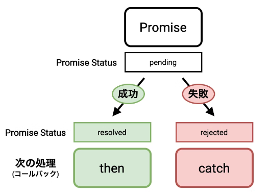

*[page-title]:Promise、Promise.all

PromiseとはJavaScriptにおいて、非同期処理の操作が完了したときに結果を返すものです。 結果には2通りあり、成功（完了や解決とも）と失敗（エラーや拒否とも）です。成功時には引数で渡される関数<span class="green bold">resolve</span>（リゾルブ?）を、失敗時には引数で渡される<span class="green bold">reject</span>（リジェクト）を呼び出すように記述します。


「<span class="red">非同期処理</span>」とは、ある処理が実行されてから終わるまで待たずに、次に控えている別の処理を行うことです。

なぜこのような仕組みがあるのでしょうか？

JavaScriptはシングルスレッドでしか動かない性質があるため、複数の処理を並列で走らせることができません。 そのため効率的に処理をするために考えられた仕組みが非同期処理と呼ばれるものです。


## resolveメソッドとは

resolveメソッドとは、引数に渡した値で解決したPromiseオブジェクトを返す関数です。resolveメソッドがPromiseオブジェクトを返すことによって、さらに<span class="green bold">then</span>と<span class="green bold">catch</span>で繋ぐことができます。

<p class="tmp"><span>書式1</span></p>
```
Promise.resolve(引数);
```
<p class="tmp"><span>書式2</span>thenでつなぐ</p>
```
const 変数 = Promise.resolve(引数); //Promiseオブジェクトを変数に格納

変数.then(function(value) {
  //処理
}

または、
Promise.resolve(引数).then(function(value) {
  //処理
}
```
<div class="exp">
	<p class="tmp"><span>例1</span>thenでつないだresolveメソッドの使い方</p>
	resolveメソッドの引数へ「成功」の文字列を渡して呼び出します。  <br>
これがPromiseを返すので、thenメソッドの引数に渡したハンドラ（関数のこと）が呼び出されます。<br>  
引数valueには「成功」の文字列が代入されており、結果としてコンソールに「成功」文字が出力されます。
<iframe width="100%" height="200" src="//jsfiddle.net/hirao/fcdnLow1/6/embedded/js,result/" allowfullscreen="allowfullscreen" allowpaymentrequest frameborder="0"></iframe>
</div>

アロー関数を使った場合は、下記になります。

<div class="exp">
	<p class="tmp"><span>例1-1</span>アロー関数を使った書き方</p>
<iframe width="100%" height="200" src="//jsfiddle.net/hirao/4fwLq5bs/7/embedded/js,result/" allowfullscreen="allowfullscreen" allowpaymentrequest frameborder="0"></iframe>
</div>


### resolveメソッドに複数の値を渡す方法

resolveメソッドに複数の値を渡すには、配列もしくはオブジェクトを使います。まずは、配列を使って複数の値を渡してみます。

<div class="exp">
	<p class="tmp"><span>例2</span></p>
	<script async src="//jsfiddle.net/f1so7pyg/embed/js,result/"></script>
</div>


コンソールに配列のすべての値が出力されます。次に、オブジェクトを使って複数の値を渡してみます。

<div class="exp">
	<p class="tmp"><span>例3</span></p>
	<script async src="//jsfiddle.net/80cs47kz/embed/js,result/"></script>
</div>


### new Promise

new promise が作成されると、中の処理は自動的に実行されます。

<p class="tmp"><span>書式3</span>new Promise</p>
```
const 変数 = new Promise((resolve) => {  //Promiseオブジェクトを変数に格納
	//処理を実行
})

変数.then(() => {
	//処理が無事終わったことを受けとって実行される処理
});

または、
new Promise((resolve) => {
	//処理を実行
	resolve(); //無事処理が終わったことを伝える
}).then(() => {
	//処理が無事終わったことを受けとって実行される処理
});
```

### Promiseには3つの状態がある
Promiseには、<span class="red">PromiseStatus</span>というstatusがあり、3つのstatusがあります。

<span class="bold">pending</span>: 未解決 (処理が終わるのを待っている状態)  
<span class="green bold">resolved</span>: 解決済み (処理が終わり、無事成功した状態)  
<span class="blue bold">rejected</span>: 拒否 (処理が失敗に終わってしまった状態)

<span class="red">new Promise()</span>で作られたPromiseオブジェクトは、pendeingというPromiseStatusで作られます。  
処理が成功した時に、PromiseStatusは<span class="green bold">resolved</span>に変わり,<span class="green bold">then</span>に書かれた処理が実行されます。  
処理が失敗した時は、PromiseStatusが<span class="blue bold">rejected</span>に変わり、<span class="blue bold">catch</span>に書かれた処理が実行されます。



<p class="tmp"><span>書式4</span>rejectステータスを追加</p>
```
new Promise((resolve, reject) => {
    resolve(); //または失敗時には、reject(); を記述
}).then(() => {
    //処理が無事終わったことを受けとって実行される処理
}).catch(() => {
    //処理が失敗したことを受けとって実行される処理
});
```

<div class="exp">
	<p class="tmp"><span>例4</span></p>
	<iframe width="100%" height="300" src="//jsfiddle.net/hirao/kzogy7x6/6/embedded/js,result/" allowfullscreen="allowfullscreen" allowpaymentrequest frameborder="0"></iframe>
</div>


これらだけでは非同期処理っぽくないので、少しコードを変えてみましょう。

<div class="exp">
	<p class="tmp"><span>例5</span></p>
<iframe width="100%" height="300" src="//jsfiddle.net/hirao/2593s78o/17/embedded/js,result/" allowfullscreen="allowfullscreen" allowpaymentrequest frameborder="0"></iframe>
</div>

<!--
<div class="exp">
	<p class="tmp"><span>例</span></p>
<iframe width="100%" height="400" src="//jsfiddle.net/hirao/2593s78o/22/embedded/js,result/" allowfullscreen="allowfullscreen" allowpaymentrequest frameborder="0"></iframe>
</div>
-->

promiseの最大のメリットは非同期処理終了後の結果に応じて処理を分岐できることです。これによりプログラムの中で行いたい処理の順番を明確に指定することができます。promise(約束)の意味通り、意図した処理順番を約束してくれるのがpromiseのメリットだと思います。

インスタンス化したpromiseの中では、非同期処理が成功なら「resolve(日本語で解決の意)」、失敗なら「reject(日本語で拒絶の意)」という関数を呼び出します。プロミスを使うことで非同期処理通信の成否によって処理を分岐させることが可能になります。


## コールバック関数地獄

コールバックは使い勝手がいい反面、使いすぎるとコードが非常に読みにくくなる欠点があります。また関数から関数を呼ぶ処理を繰り返しすぎると、あとで問題が発生したときに調べることが手間になりがちです。これをコールバック関数地獄と言います。

非同期処理のコールバック例
```
sampleFunction1(function(data1) {

    sampleFunction2(function(data2) {
        
        sampleFunction3(function(data3) {
            
            sampleFunction4(function(data4) {
                //処理
            });
            
        });
        
    });
    
});
```
JavaScriptにおける非同期処理のコールバック関数地獄はネストが深くなる上に、エラー処理が相まって、可読性を著しく下げる傾向があります。このコールバック地獄を避けるために考えられたの仕組みが、***Promise***です。

## Promiseの処理を連結させる方法
<span class="red">チェイン</span>を使って処理を連結させた例が以下コードになります。

コードの中身は、getNumber関数は渡された数字numを受け取り、numに対して3を2回加算するというものです。

.thenを3回連続で使用している箇所がありますが、これが<span class="red">チェイン</span>と呼ばれるものです。このように、Promiseでは複数の処理を連続で処理させることが可能です。


<div class="exp">
	<p class="tmp"><span>例6</span></p>
	<iframe width="100%" height="650" src="//jsfiddle.net/hirao/9mfje0Ly/1/embedded/js,result/" allowfullscreen="allowfullscreen" allowpaymentrequest frameborder="0"></iframe>
</div>


## allを使って複数の非同期処理を同時に行う
allを使うことで、複数の非同期処理を同時に実行することができます。

書き方は以下の通りです。

<p class="tmp"><span>書式5</span></p>
```
Promise.all(iterable).then(function(message) {
    // 結果を表示する処理
}
```

<div class="exp">
	<p class="tmp"><span>例7</span></p>
<iframe width="100%" height="650" src="//jsfiddle.net/hirao/yn3gtrwa/3/embedded/js,result/" allowfullscreen="allowfullscreen" allowpaymentrequest frameborder="0"></iframe>
</div>


allはすべての非同期処理がresolveされたタイミングで結果を返します。

上のサンプルの例ですと、promise1は300ms後, promise3は500ms後に処理されることになっていますが、1000ms後にresolveされるpromise2が完了したタイミングで結果を返します。

ですので上のサンプルコードは

* console.log("First");
* console.log("Second");
* setTimeout(function(){console.log("Third")}, 600);
* Promise.all([promise1, promise2, promise3])~

の順番で結果を返していることがわかります。


## catchを使ったエラーハンドリングのやり方

エラーハンドリングを行うために必要である、catchの使い方を説明します。  
catchを使うことで、チェインを実行している最中にエラーが発生してもエラーを捕まえることができます。  
下のコードでは2つ目のチェインに入った段階でエラーを発生させているので、3を加算した結果である「6」を返す前にエラーメッセージを表示させます。

<p class="tmp exp"><span>例8</span></p>
<script async src="//jsfiddle.net/0djtqpc4/embed/js,result/"></script>

Promiseをおさらいすると、以下のようになります。

* Promiseは処理が成功すればresolveを返し、失敗ならrejectを返す
* Promiseを使うと、ネストを深くせずに非同期処理のコールバック関数が書ける
* チェインを使うことで、複数の処理を連続して処理できるようになる
* allはすべての非同期処理が完了した時点で、resolveを返す
* catchを使い、エラーが発生した時点でエラーを返すようにできる

これらの特性から、非同期処理時はPromiseを使うようにすると、コード記述時にミスやエラーが発生する可能性を減らすことができます。


## 参考サイト

* [【JavaScript】初心者にもわかるPromiseの使い方プログラミング](https://techplay.jp/column/581)
* [JavaScriptのresolveメソッドの使い方を現役エンジニアが解説【初心者向け】](https://techacademy.jp/magazine/29267)