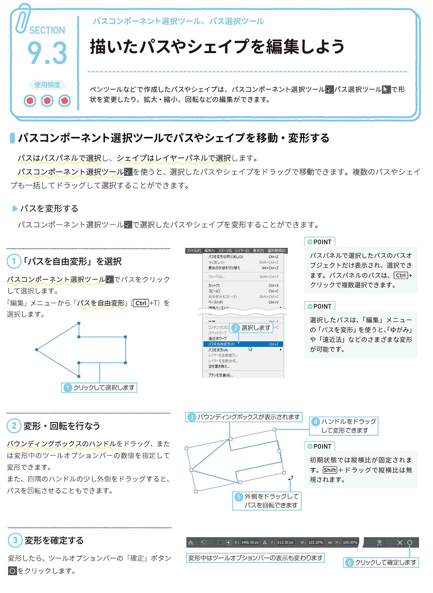
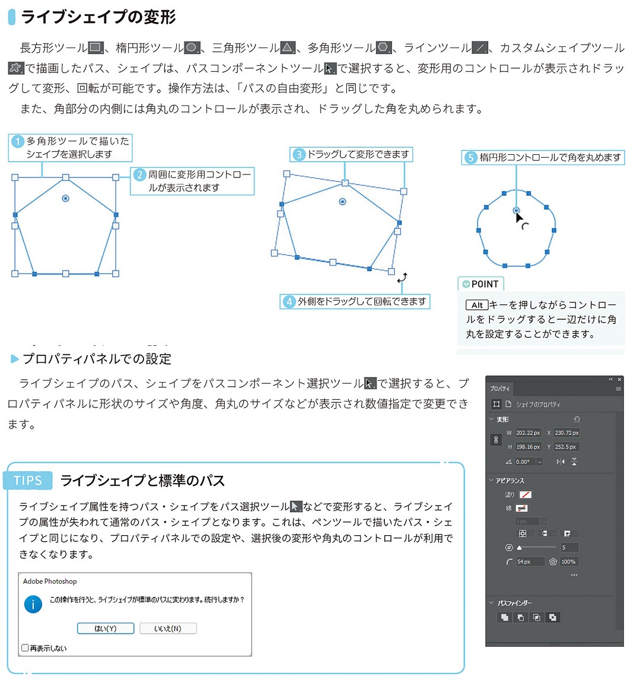
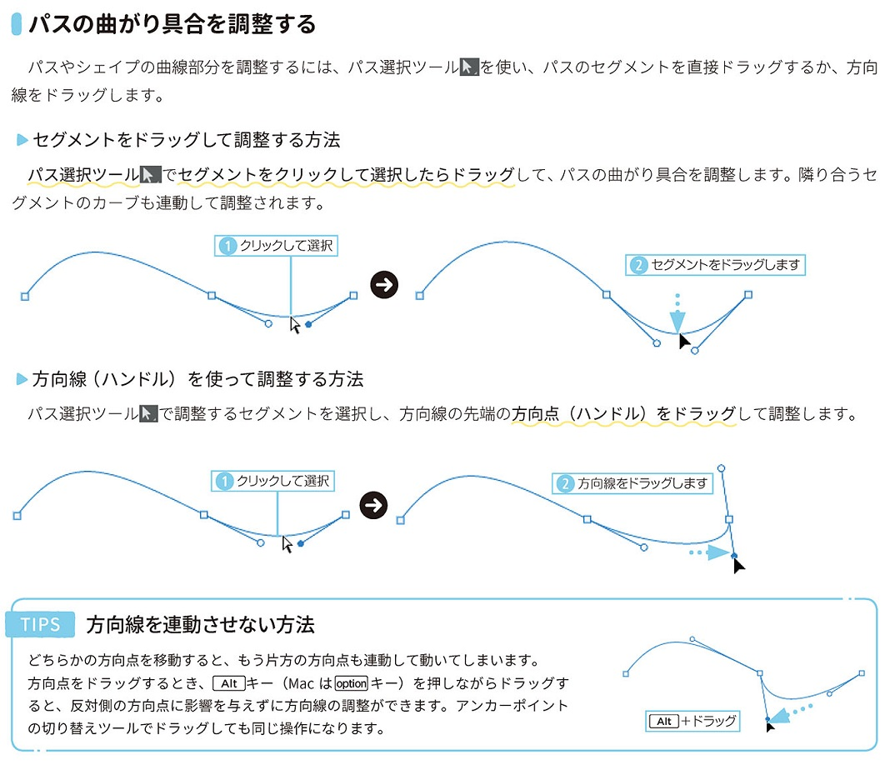
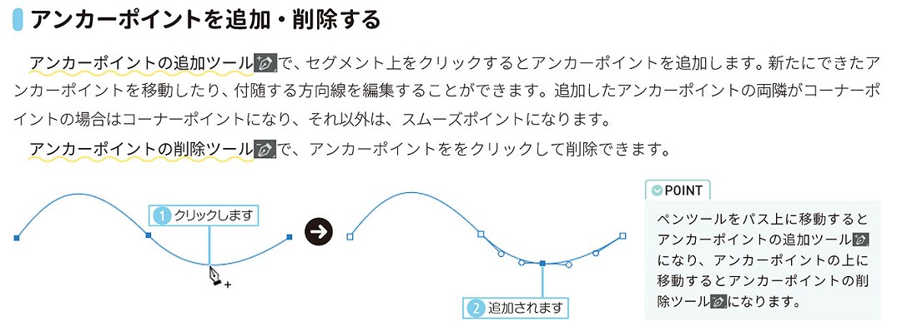
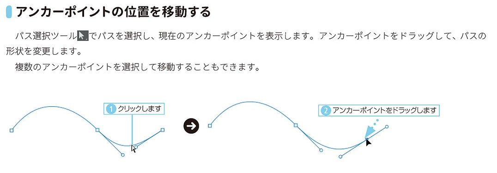
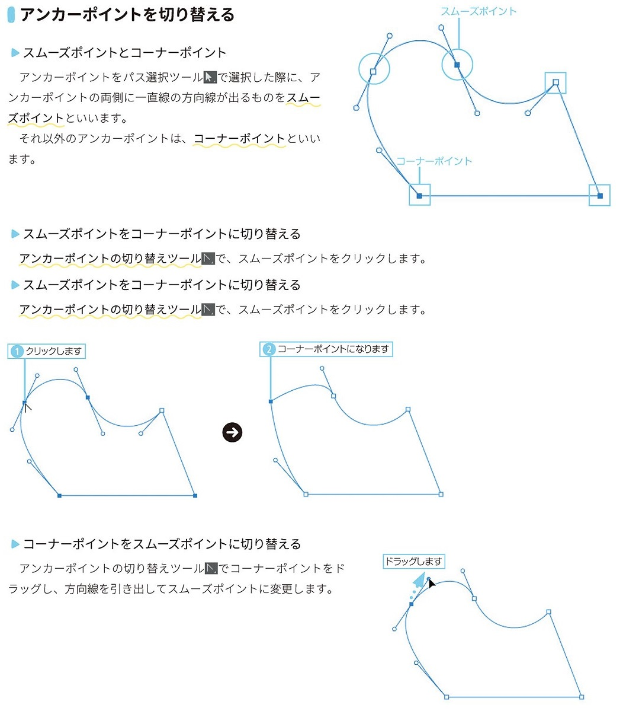

*[page-title]:9-3. 描いたパスやシェイプの編集

## パスコンポーネント選択ツールでパスやシェイプを移動・変形する。 ##{.sr-only}

{.image}

## ライブシェイプの変形 ##{.sr-only}

{.image}

## パスの曲がり具合を調整する ##{.sr-only}

{.image}

## アンカーポイントを追加・削除する ##{.sr-only}

{.image}

## アンカーポイントの位置を移動する ##{.sr-only}

{.image}

## アンカーポイントを切り替える ##{.sr-only}

{.image}

